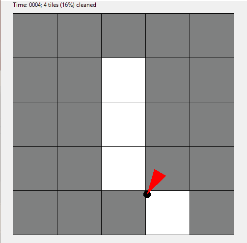
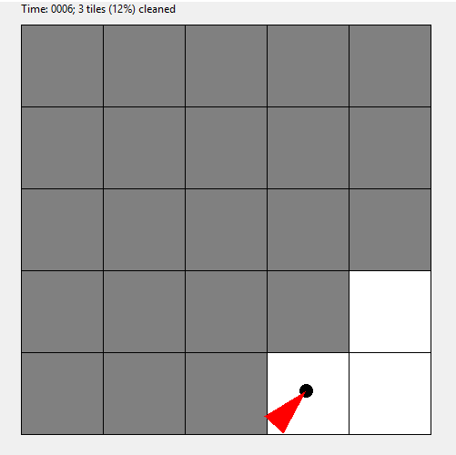
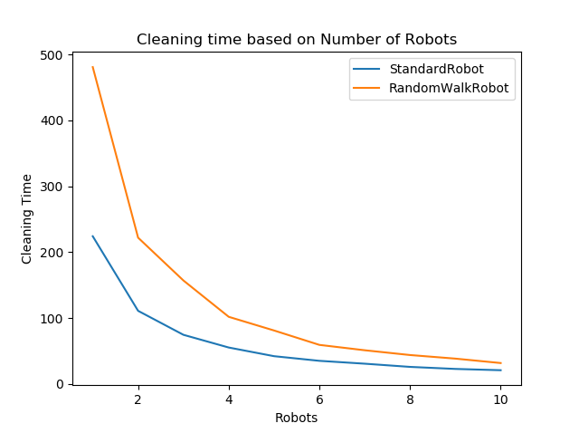
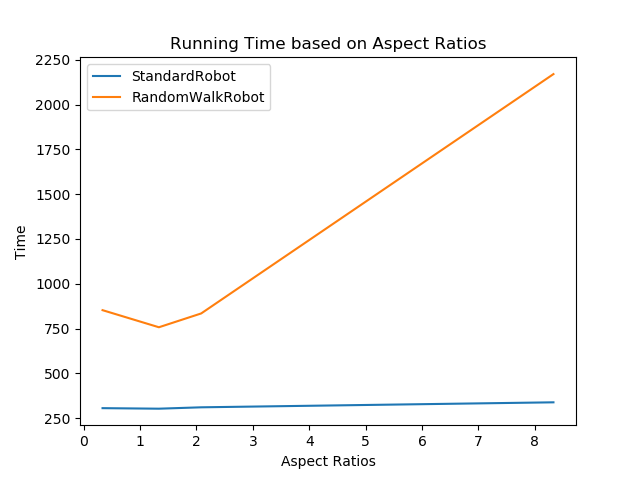

# iRoomba
A Python implementation of 2 types of "Roomba" autonomous robots

The program creates and implements the functionality of 2 types of robotic vaccum cleaners:
  - Standard Robot- Runs until it hits a wall, then changes directions
  - Random Robot- Changes direction after each time step
  
Program implements a visual representation of the 2 robots cleaning a rectangular room object:

Standard Robot:

Random Robot:

The program finishes by comparing the run times with varying number of robots and different aspect ratios within a rectangular room:

Number of Robots:

Aspect Ratio:

*Some accessory open source code imported from MIT OCW
